# Context Mapping and Driver Behavior tutorial, Part 1: Sending car probe data and issuing analysis requests

The first part of this tutorial describes how you can set up your Bluemix environment to use the following services for simulating and analyzing driver behavior.

- **Watson IoT Platform** uses the MQTT protocol to retrieve car probe data from a simulated car, and then passes that data to the **Node-RED** service. Car probe data is a sequence of car probes that are ordered by timestamp. A single car probe consists of the heading, latitude, longitude, speed, and timestamp retrieved from the car for each journey that is recorded.
- **Node-RED Starter** creates work flows between components of the sample application. The **Node-RED** visual tool helps you to easily understand the work flows.
- **Watson IoT Driver Behavior** gives you an insight into the behavior of a driver during the simulated journey from the associated car probe data.
The **Driver Behavior** APIs let you use both the context data and the car probe data to analyze the journey and to identify the driving behaviors, such as:
 * Speeding
 * Frequent acceleration and braking
 * Harsh acceleration and braking
 * Sharp turns
- **Watson IoT Context Mapping** provides a service API from which you can extract further information from the car probe data, such as:
 * The exact location of the car on a mapped road, because the location data from the car is not accurate
 * The road ID, which is called `link_id` in APIs, of the road that the car traveled


## Overview
In part 1 of this tutorial, you will learn the following:

1. How to set up **Driver Behavior** and **Context Mapping**.
2. The types of car data that is needed to analyze the behavior of a driver.
3. How to send the car probe data to the  **Context Mapping** and **Driver Behavior** services by using the **Watson IoT Platform** and **Node-RED** services.
4. How to analyze the behavior of a driver.  
**Note:** After you send a job request by using the **Driver Behavior** API, the job ID is generated, which you will need in *part 2 of this tutorial*.

In part 2 of this tutorial, you will learn how to see the results of the analysis on a map user interface by hovering the cursor over points on the map.


For *"Tutorial part 2: Displaying the analysis result on a Java client map UI"*, refer to [this GitHub repository](https://github.com/IBM-Bluemix/map-driver-insights)

### Process
The following steps provide a sequential outline of how your application interacts with the **Driver Behavior** API:

**Note:** Steps 1 - 4 are explained below, and steps 5 - 7 are explained in part 2 of the tutorial.

1. The Java client that simulates a car sends car probe data from to the **Watson IoT Platform** instance.
2. The application receives the car probe data and then adds more data to the car probe data by using the **Context Mapping** API.
     - Gets map matched car probe data by using the `mapMatching` API of **Context Mapping**.
        - [Request] Car probe data
        - [Response] Map matched car probe data
     - Gets road type data by using the `getLinkInformation` API of **Context Mapping**.
        - [Request] Road link ID
        - [Response] Road type
3. The application sends car probe data to the store so that it can then be analyzed by using `sendCarProbe` API of **Driver Behavior**.
   - [Request] Map matched car probe data and Road type
4. The application sends a job request to analyze car probe data by using the `sendJobRequest` API of **Driver Behavior**.
   - [Request] Date from and to
   - [Response] Job ID     
5. The application gets the analyzed trip summary list by using the `getAnalyzedTripSummaryList` API of **Driver Behavior**.
   - [Request] Job ID
   - [Response] List of analyzed trip summary
6.  The application gets the analyzed trip information by using the `getAnalyzedTripInfo` API of **Driver Behavior**.
   - [Request] Trip UUID
   - [Response] Details of the analyzed trip
7. The application displays the analyzed results on a map UI from the Java client.

### Architecture
<p align="center">
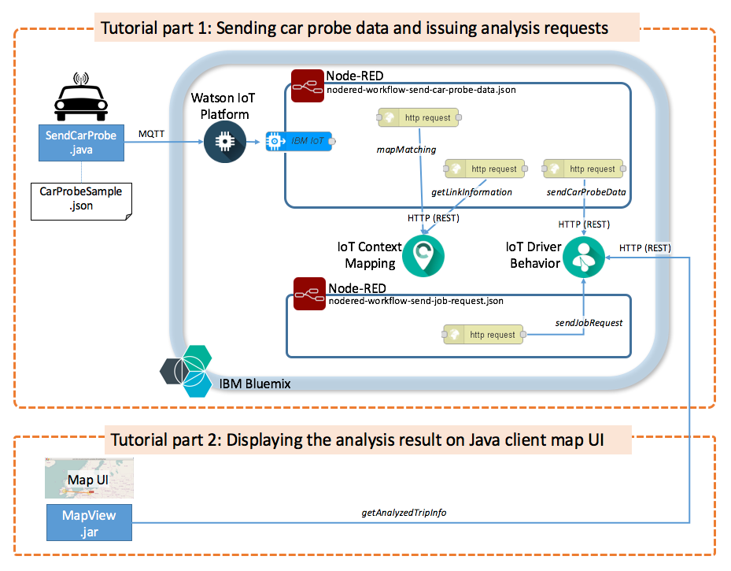
<br/>Architecture diagram of the Watson IoT Context Mapping and Driver Behavior services
</p>

## Before you begin

### Bluemix access
If you do not already have a Bluemix ID, click the following link to register: [https://console.ng.bluemix.net/registration/](https://console.ng.bluemix.net/registration/).

### System requirements
To complete the tutorial, the following prerequisite software must be installed on your system:

   * Java V1.7 or higher to run the Watson IoT Platform Java client.
   * [Git](https://git-scm.com/) to clone project code locally.
   * Requires [maven](https://maven.apache.org/download.cgi) to build the Java client of the Watson IoT Platform.
   * Optional: [Eclipse](https://eclipse.org/) to run the IoT Platform Java client.
   * [IBM Watson IoT Platform Java Client Library](https://github.com/ibm-messaging/iot-java)

### Deliverables
When you complete part 1 of this tutorial, the following components are downloaded:


|                   File                        |Description                                           |
|--------------------------------------------------------|------------------------------------------------------|
|[SendCarProbe.java](src/main/java/com/ibm/iot/auto/bluemix/samples/nodered/SendCarProbe.java)|Sample Java to send car probe data to Watson IoT Platform|
|[device.prop](config/device.prop)|A configuration file of SendCarProbe.java, which is used to load the credentials of Watson IoT Platform|
|[nodered-workflow-send-car-probe-data.json](nodered/nodered-workflow-send-car-probe-data.json)|Node-RED flow to receive car probe data from Watson IoT Platform and to store the data into the Driver Behavior service|
|[nodered-workflow-send-job-request.json](nodered/nodered-workflow-send-job-request.json)|Node-RED flow to send a driving behavior analysis request|
|[CarProbeSample.json](data/CarProbeSample.json)|Sample car probe data|

### Bluemix applications and services
When you complete the instructions in this tutorial, the following services will be instantiated in your Bluemix organization:

   * [IBM Watson IoT Context Mapping](https://console.ng.bluemix.net/catalog/services/context-mapping/)
   * [IBM Watson IoT Driver Behavior](https://console.ng.bluemix.net/catalog/services/driver-behavior/)
   * [IBM Watson IoT Platform](https://console.ng.bluemix.net/catalog/services/internet-of-things-platform/)
   * [Node-RED Starter](https://console.ng.bluemix.net/catalog/starters/node-red-starter/)


## Tutorial Part 1: Sending car probe data and issuing analysis requests

To complete part 1 of the tutorial, you must complete the following tasks:

1. [Setting up Context Mapping](#set_up_context_mapping).
2. [Setting up Driver Behavior](#set_up_driver_behavior).
3. [Creating the Node-RED application](#create_the_node_red_app).
4. [Setting up a Watson IoT Platform instance](#set_up_iot_platform).
5. [Setting up the Node-RED workflow for sending car probe data](#send_car_probe_data).
6. [Setting up the Node-RED workflow for sending analysis job requests](#send_analysis_job_request).
7. [Setting up the Java client of the Watson IoT Platform](#set_up_iot_platform_java_client).
8. [Running the Send Car Probe Data sample](#run_sample_send_car_probe_data).
9. [Running the Send Analysis Job Request sample](#run_sample_send_analysis_job_request).
10. [Optional: Setting up and running the Watson IoT Platform Java client by using Eclipse](#set_up_iot_platform_java_client_without_eclipse).


### Step 1: Setting up Context Mapping
<a name="set_up_context_mapping"></a>
This section explains how to subscribe **Context Mapping** that is required for this sample application.

1. Go to the [IoT Context Mapping service](https://console.ng.bluemix.net/catalog/services/context-mapping/) in the Bluemix catalog.
1. Select the **Free** plan option, enter the required information, and then click  **CREATE**. <br>
**WARNING:** If you do not select the **Free** plan option, there could be a payment charge for using this service.
<p align="center">
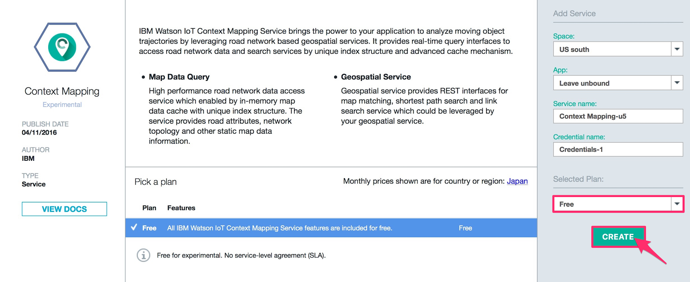
</p>
1. Make a note of the following information for your service instance, as you will need this information later on in the process.
<ul>
<li>Tenant ID</li>
<li>Username</li>
<li>Password</li>
</ul>

 <p align="center">
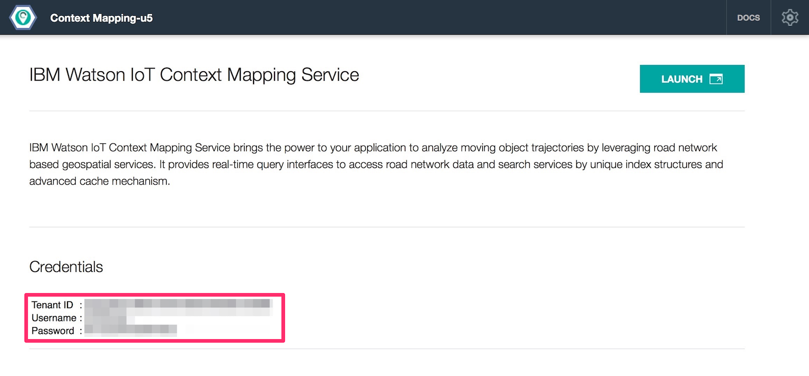
</p>

### Step 2: Setting up Driver Behavior
<a name="set_up_driver_behavior"></a>
Complete the following steps to set up and subscribe the **Driver Behavior** service:

1. Go to the [IoT Driver Behavior service](https://console.ng.bluemix.net/catalog/services/driver-behavior/) in the Bluemix catalog.
1. Select the **Free** plan option, enter the required information, and then click  **CREATE**. <br>
**WARNING:** If you do not select the **Free** plan option, there could be a payment charge for using this service.
<p align="center">
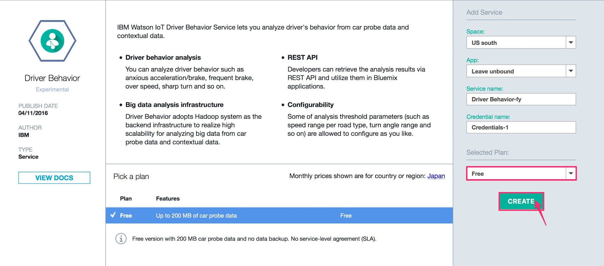
</p>

1. Make a note of the following information for your service instance, as you will need this information later on in the process.
<p align="center">
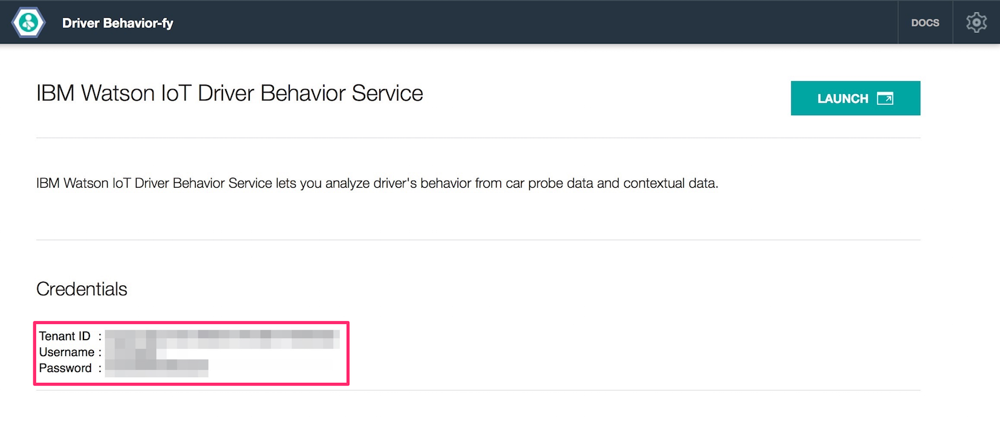
</p>


### Step 3: Creating the Node-RED application
<a name="create_the_node_red_app"></a>
Complete the following steps to set up and subscribe the required **Node-RED** application:

1. Go to the [Node-RED Starter boilerplate](https://console.ng.bluemix.net/catalog/starters/node-red-starter/) in the Bluemix catalog.
2. Enter a name, for example, ``watson-iot-sample``.
3. **Default** on **SDK for Node.js**, and select **Shared** on **Cloudant NoSQL DB**.
1. Click **SDK for Node.js** service, and then select **Default** plan on **Pick a Plan** list.
1. Click **Cloudant NoSQL DB** service, and then select **Default** plan on **Pick a Plan** list.
1. Click **CREATE**.  
**WARNING:** If you exceed the threshold levels that are described in this plan, you could be required to pay further charges.
<p align="center">
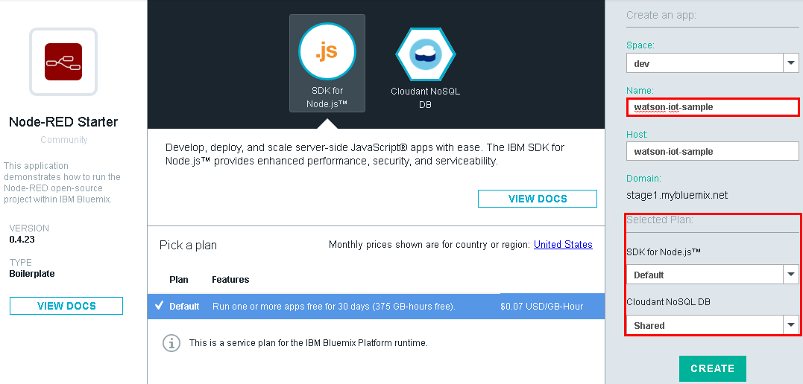
</p>


### Step 4: Set up the Watson IoT Platform instance
<a name="set_up_iot_platform"></a>
Complete the following steps to subscribe the required **Watson IoT Platform**.

1. Go to the [IoT Platform service](https://console.ng.bluemix.net/catalog/services/internet-of-things-platform/) in the Bluemix catalog.
1. Under **App** heading, select the ``watson-iot-sample`` that you created earlier in step 3.
1. Select the **Free** plan option, enter the required information, and then click  **CREATE**. <br>
**WARNING:** If you do not select the **Free** plan option, there could be a payment charge for using this service.
<p align="center">
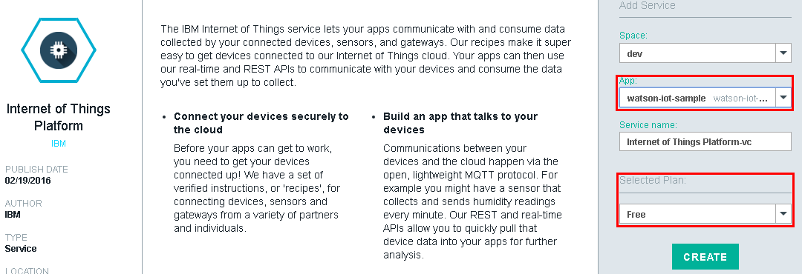
</p>

1. When prompted, click **RESTAGE**.
<p align="center">
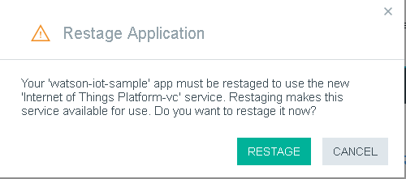
</p>

1. Go to your **Internet of Things Platform** service and click **Launch dashboard**.
<p align="center">
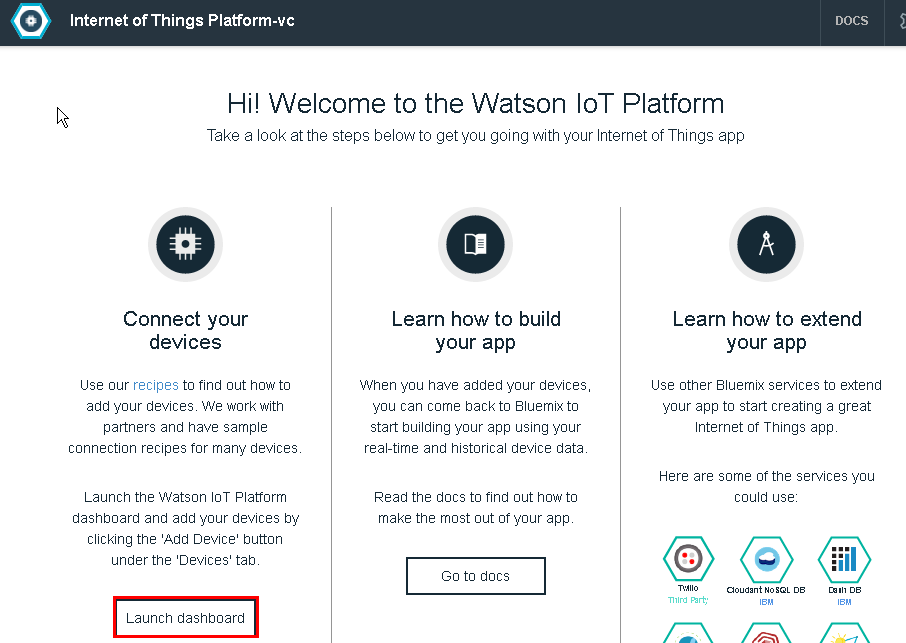
</p>

1. Click **Add Device**. Step 5-11 is for registering **Vehicle** type for sample application in **Watson IoT Platform**.
<p align="center">

</p>

1. Click **Create device type**.
<p align="center">

</p>

1. Click **Create device type** again.  
<p align="center">
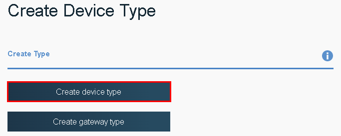
</p>

1. Enter `vehicle` as the **Name**, and then click **Next**.
<p align="center">
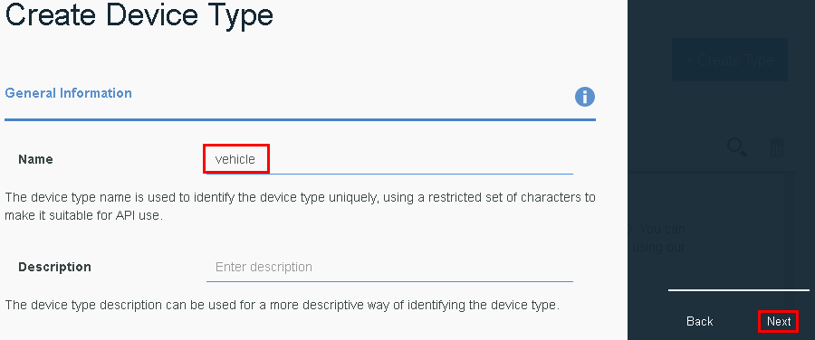
</p>

1. Click **Next**.
<p align="center">
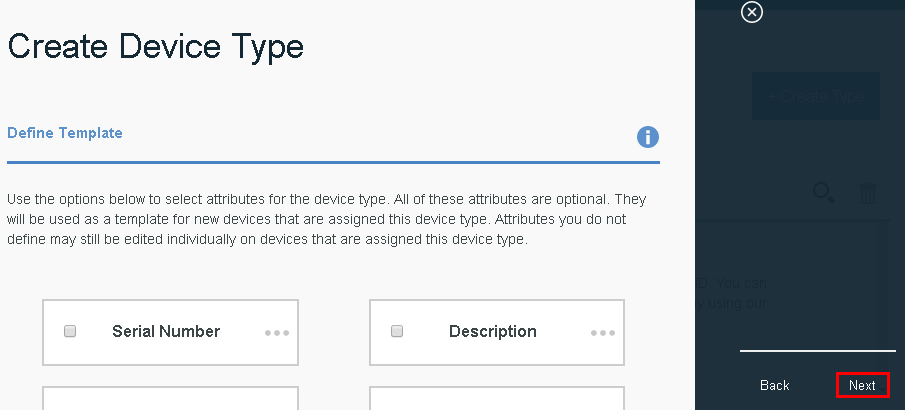
</p>

1. Click **Next** again.
<p align="center">
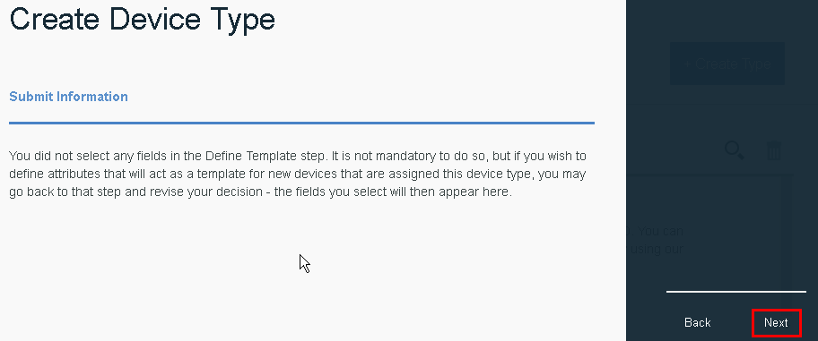
</p>

1. Click **Create**.
<p align="center">
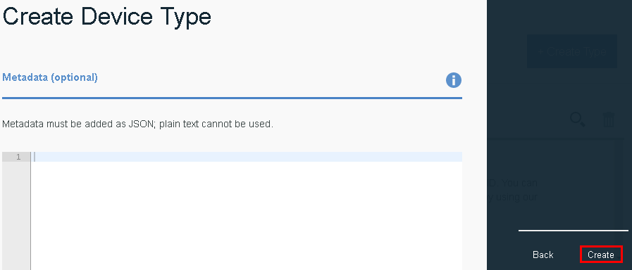
</p>

1. <a name="config_device"></a>Click **vehicle** as device type, followed by **Next**. Steps 13-18 are for registering a single sample vehicle for the sample application in **Watson IoT Platform**.
<p align="center">

</p>

1. For **Device ID**, specify `vehicle-sample`, and then click **Next**.
<p align="center">
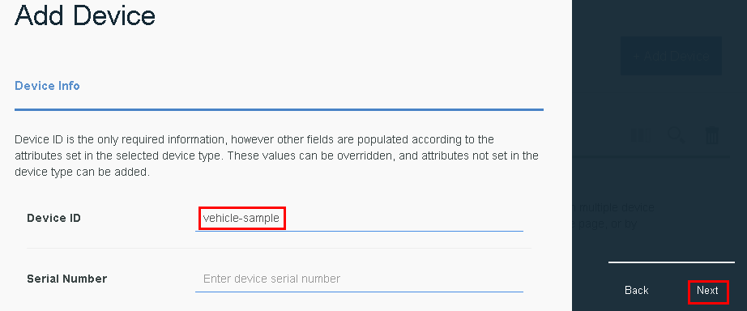
</p>

1. Click **Next**.
<p align="center">
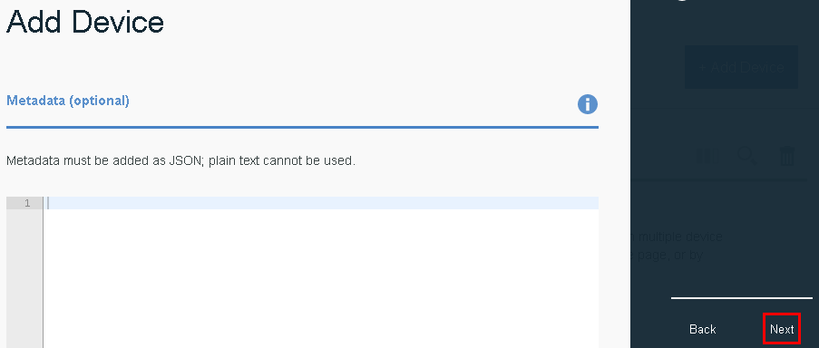
</p>

1. Click **Next**.
<p align="center">

</p>

1. Click **Add**.
<p align="center">
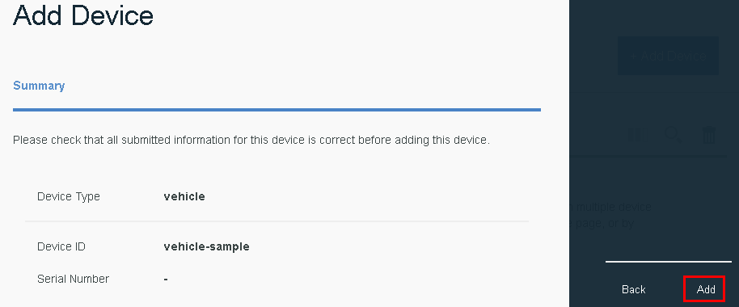
</p>

1. Make a note of the **Organization ID** and **Authentication Token** as you will need these credentials later on in the process when you set up the sample application.
<p align="center">
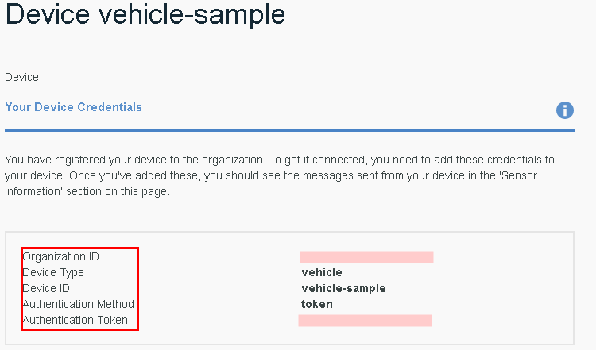
</p>


### Step 5: Setting up the Node-RED workflow for sending car probe data
<a name="send_car_probe_data"></a>
The **Node-RED** workflow receives car probe data through the **Watson IoT Platform**. The workflow adds more properties to the car probe data by calling the  **Context Mapping** API and storing the car probe data into **Driver Behavior** to be analyzed.

1. Return to the Bluemix dashboard, go to your **Node-RED** application, and then click the Routes link.
<p align="center">
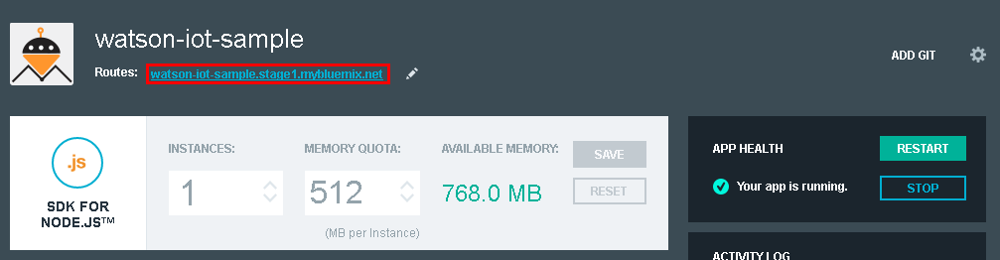
</p>

1. Click **Go to your Node-RED flow editor**.
<p align="center">
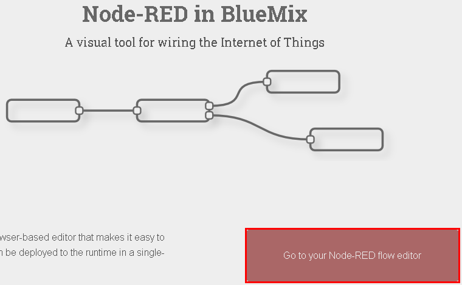
</p>

1. Open the menu on the upper right, click **Flows > Rename**, and rename the flow to `Send Car Probe Data`.
<p align="center">
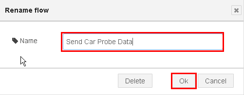
</p>

1. Go back to the menu, and click **Import > Clipboard**.
<p align="center">
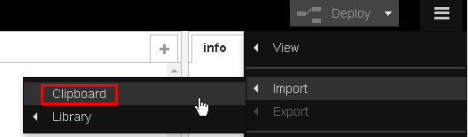
</p>

1. Copy the content from [nodered-workflow-send-car-probe-data.json](nodered/nodered-workflow-send-car-probe-data.json) and click **OK**.
<p align="center">
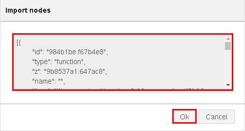
</p>

1. Double-click the **Common Config** node.
<p align="center">
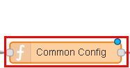
</p>

1. Set the values for `msg.mapTenantId` and `msg.driverTenantId`.
   * `msg.mapTenantId`: Tenant ID from **Context Mapping**
   * `msg.driverTenantId`: Tenant ID from **Driver Behavior**
<p align="center">
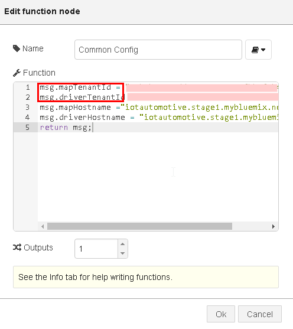
</p>

1. Double-click the **mapMatching** node.
<p align="center">
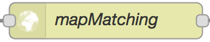
</p>

1. Select **Use basic authentication?** and enter the following credentials:
   * **Username**: Username from **Context Mapping**
   * **Password**: Password from **Context Mapping**
<p align="center">

</p>

1. Double-click the **getLinkInformation** node.
<p align="center">

</p>

1. Select **Use basic authentication?** and enter the following credentials:
   * **Username**: Username from **Context Mapping**
   * **Password**: Password from **Context Mapping**

12. Double-click **carProbe**.
<p align="center">
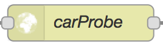
</p>
1. Select **Use basic authentication?** and enter the following credentials:
   * **Username**: Username from **Driver Behavior**
   * **Password**: Password from **Driver Behavior**

1. Click **Deploy**  and wait for the **Successfully deployed** notification.  
<p align="center">

</p>

### Step 6: Setting up the Node-RED workflow for sending analysis job requests
<a name="send_analysis_job_request"></a>
This **Node-RED** workflow requests an analysis job for the stored car probe data.

1. Create another new tab in the **Nod-RED** editor by clicking the upper right **`+`** icon, and rename the tab to `Send Job Request`.
<p align="center">

</p>

1. Click **Import > Clipboard**.
<p align="center">

</p>

1. Copy the content from [nodered-workflow-send-job-request.json](nodered/nodered-workflow-send-job-request.json) and click **OK**.

1. Double-click **Config**.
<p align="center">
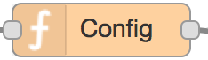
</p>

1. <a name="config_fromto"></a>Enter a value for `msg.driverTenantId`.
   * `msg.driverTenantId`: Tenant ID from **Driver Behavior**
<p align="center">
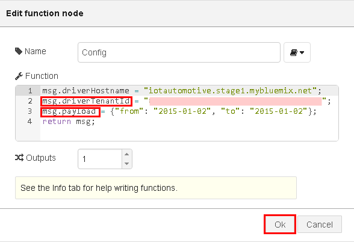
</p>

1. Double-click **sendJobRequest**.
<p align="center">

</p>

1. Select **Use basic authentication?** enter the following credentials:
   * **Username**: Username from **Driver Behavior**
   * **Password**: Password from **Driver Behavior**
<p align="center">
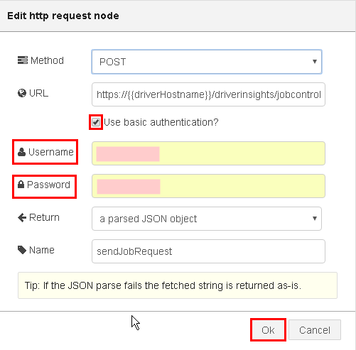
</p>

1. Click **Deploy**  and wait for the **Successfully deployed** notification.
<p align="center">

</p>

### Step 7: Setting up the Java client of the Watson IoT Platform

<a name="set_up_iot_platform_java_client"></a>
Complete the following instructions to set up and configure the Java client. Alternatively, you can skip step 7 and [set up and run IoT Platform Java client using Eclipse](#set_up_iot_platform_java_client_without_eclipse) instead.

The Java client that you are about to install, loads sample car probe data from a file named `CarProbeSample.json`, and then sends the data to the **Watson IoT Platform** instance by using the **Watson IoT Platform** Java API `com.ibm.iotf.client.device.DeviceClient`. The file `device.prop` provides the configuration for the **Watson IoT Platform** Java API. The car probe data is received by a **Node-RED** workflow through threshold **Watson IoT Platform** and is processed by the workflow logic.

1. Clone the **car-data-management** project by using git clone, as follows:

    `git clone https://github.com/IBM-Bluemix/car-data-management`

1. Navigate to the **car-data-management** project.

    `cd car-data-management`

1. Run the maven build as follows to build the Java client.

    `mvn clean compile`

The Java Client library for the Watson IoT Platform and all required dependencies are downloaded and the build process starts.

### Step 8: Running the Send Car Probe Data sample
<a name="run_sample_send_car_probe_data"></a>

1. Edit the `config/device.prop` file, and add the `Organization-ID` and `Authentication-Token`, which you recorded in the previous step section.

1. Run the sample by using the following maven command:

    `mvn test`

3. To see whether the Java client Successfully transmitted the car probe data to **Watson IoT Platform**, check the log file:

    ```
...
[INFO] --- exec-maven-plugin:1.4.0:java (default) @ samples.car-data-management ---
4 28, 2016 3:29:59 ?? com.ibm.iotf.client.AbstractClient createClient
??: com.ibm.iot.auto.bluemix.samples.nodered.SendCarProbe.main(): Org ID    = XXXXX
         Client ID    = d:XXXXX:vehicle:vehicle-sample
4 28, 2016 3:29:59 ?? com.ibm.iotf.client.AbstractClient connect
??: com.ibm.iot.auto.bluemix.samples.nodered.SendCarProbe.main(): Connecting client d:XXXXX:vehicle:vehicle-sample to ssl://XXXXX.messaging.internetofthings.ibmcloud.com:8883 (attempt #1)...
4 28, 2016 3:30:01 ?? com.ibm.iotf.client.AbstractClient connect
??: com.ibm.iot.auto.bluemix.samples.nodered.SendCarProbe.main(): Successfully connected to the IBM Watson IoT Platform
{"heading":273.995431,"latitude":30.398979,"longitude":-97.746781,"speed":0.0,"timestamp":"2016-03-11T13:43:16.000Z","trip_id":"1457671273"}
{"heading":273.995431,"latitude":30.398981,"longitude":-97.746804,"speed":8.256416399999999,"timestamp":"2016-03-11T13:43:17.000Z","trip_id":"1457671273"}
{"heading":273.995431,"latitude":30.398984,"longitude":-97.746846,"speed":14.5477296,"timestamp":"2016-03-11T13:43:18.000Z","trip_id":"1457671273"}
{"heading":273.995431,"latitude":30.398987,"longitude":-97.746895,"speed":16.8379884,"timestamp":"2016-03-11T13:43:19.000Z","trip_id":"1457671273"}
...
    ```

1. To confirm whether the message arrived successfully, open the **Send Car Probe Data** tab in the **Node-RED** flow editor and view the debug messages, as outlined in the following screen capture:
<p align="center">
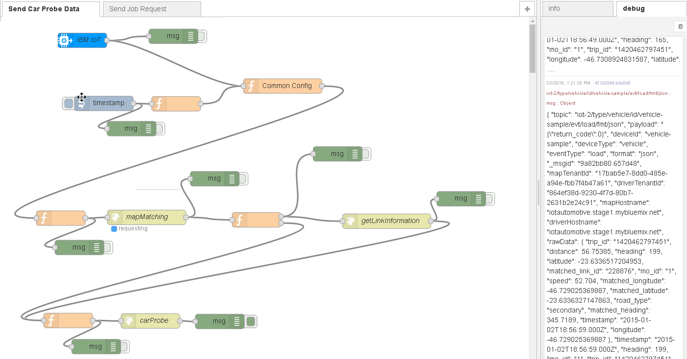
</p>

### Step 9: Running the Send Analysis Job Request sample
<a name="run_sample_send_analysis_job_request"></a>

1. Open the **Send Job Request** node tab in the **Node-RED** flow editor.

1. Click the inject icon and wait for the workflow request to complete. After the request is completed, view the debug output message that is generated for the job request. Make a note of the  `job_id` value.
<p align="center">
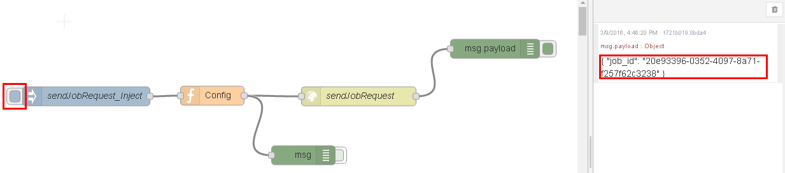
</p>
**Important:** The analysis request is an asynchronous batch job, so you must wait for all  **Driver Behavior** APIs jobs to complete before you can see the analysis results.

1. To view the analysis results, proceed to [*"Tutorial Part 2: Displaying the analysis result on a Java client map UI"*](https://github.com/IBM-Bluemix/map-driver-insights).

### Optional: Setting up and running the Watson IoT Platform Java client by using Eclipse
<a name="set_up_iot_platform_java_client_without_eclipse"></a>
As an alternative to step 7, you can set up and run the Java client in the Eclipse environment instead.

Before you begin:
Install the Eclipse with the [Eclipse Maven plugin](http://www.eclipse.org/m2e/). This is required to import and run the sample in Eclipse.
For more information about Java and Eclipse, [click here](http://help.eclipse.org/mars/index.jsp?nav=%2F1).

1. Clone the **car-data-management** project using git clone as follows;

    `git clone https://github.com/IBM-Bluemix/car-data-management`

1. Import the **car-data-management** project into Eclipse using the **File >Import... >General >Existing Projects into Workspace** option in Eclipse.

1. Open the `config/device.prop`file and enter the `Organization-ID` and `Authentication-Token` that you made a note in step 4.
<p align="center">
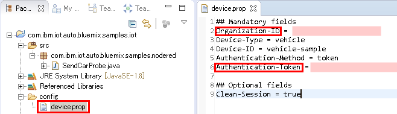
</p>

1. To build and run, right-click on the project, and select **Run As > Maven test**.

1. To confirm whether the message was successfully set to **Watson IoT Platform**, open the console tab of the Eclipse client, and view the log information.
<p align="center">
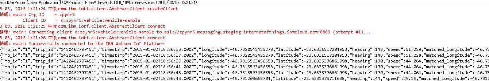
</p>


## Decomposition Instructions
* To configure analysis parameters, see [Administering Driver Behavior](https://console.ng.bluemix.net/docs/services/IotDriverInsights/iotdriverinsights_admin.html).
* To customize the car probe data further:
   * Add more devices (vehicles) to **Watson IoT Platform** in accordance with step 13 - 18 in the *"Step 4: Set up the Watson IoT Platform instance"* [section](#config_device).
   * Format your own car probe data, ensuring that you match the format in: [CarProbeSample.json](data/CarProbeSample.json).
   * Replace `CarProbeSample.json` on the Eclipse project.
   * Replace the analysis arguments `from` and `to` with your custom car probe data in this [section](#config_fromto).


## API Documentation
* [IBM Watson IoT Driver Behavior](https://new-console.ng.bluemix.net/apidocs/193)
* [IBM Watson IoT Context Mapping](https://new-console.ng.bluemix.net/apidocs/194)
